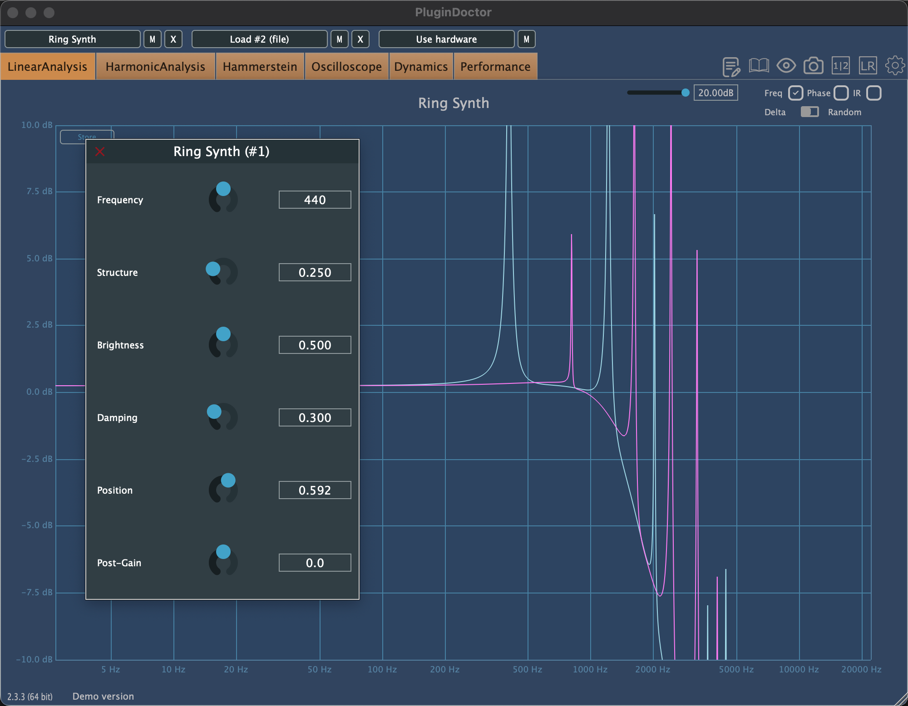
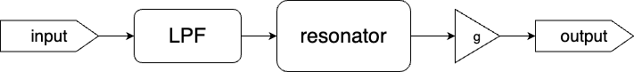

<!-- # audio programming project -->

# Modal Resonators for Real-Time Synthesis
<!-- 
### Features of [Rings resonator](https://pichenettes.github.io/mutable-instruments-documentation/modules/rings/) (Three resonator models)
1. **Modal resonator** (features are below)
2. **Sympathetic strings**, modelled by a network of comb filters. (TODO)
3. **String with non-linearity/dispersion** (comb filter with multimode filter and non-linearities in the loop). (TODO)

#### (main)[Modal resonator](https://pichenettes.github.io/mutable-instruments-documentation/modules/elements/#modal-resonator)
- Internally uses 64 zero-delay feedback state variable filters.
- **Coarse**, fine and FM frequency controls.
- **Geometry**: Interpolates through a collection of structures, including plates, strings, tubes, bowls.
- **Brightness**. Specifies the character of the material the resonating structure is made of – from wood to glass, from nylon to steel.
- **Damping**. Adds damping to the sound – simulates a wet material or the muting of the vibrations.
- **Position**. Specifies at which point the structure is excited.
- **Space**. Creates an increasingly rich stereo output by capturing the sound at two different points of the structure, and then adds more space through algorithmic reverberation. -->

## Screenshot

*Figure 1: User Interface Overview*

- `Frequency`: Adjusts the frequency of the resonating sound.
- `Structure`: Selects the material that the sound resonates with, including options such as plates, strings, tubes, and bowls.
- `Brightness`: Defines the character of the resonating material, ranging from soft (e.g., wood) to sharp (e.g., glass or steel).
- `Damping`: Adds damping to the sound, simulating effects like wetness or muting of vibrations.
- `Position`: Controls the point of excitation on the structure.
- `Post Gain`: Regulates the output volume.

## Implementation

*Figure 2: flow chart of the main process block*

As shown in Figure 2, in `MainProcessor::processBlock`, input buffer first pass through a low-pass filter, which serves as the excitation signal for the resonator. After applying the output gain, we obtain the output signal.

### Main Algorithm

**Algorithm: Resonator::ComputeFilters()**

- Interpolate stiffness and Q based on pre-calculated lookup tables.
- Reduce the range of brightness to prevent clipping.
- For i = 0 to min(kMaxModes, resolution):
  - Calculate the partial frequency.
  - Set the filter properties (frequency and quality factor Q).
  - Adjust the stretch factor.
- Return the number of modes.

**Algorithm: Resonator::process()**

- Compute the number of active modes.
- Ramp the position.
- Limit the number of output channels to 2.
- For n = 0 to numSamples - 1:  *(Loop through each sample in the input buffer)*
  - Initialize a Cosine Oscillator for amplitude modulation.
  - Get the input sample, scaled by 0.125.
  - For i = 0 to numModes - 1:  *(Process through each mode and apply filters)*
    - Process odd mode and add to output channel 0.
    - Process even mode and add to output channel 1.

## More Details

For more information and explanations, please refer to the [report](docs/report/APP_Report.pdf).

---

### TODO
- midi handler
- reverb (space)
- stereo 
- freqMod
- GUI
- polyphony ? 

### references
[demo video](https://www.youtube.com/watch?v=m27jSpFIRqA) from Mutable Instrument on YouTube

- [Modal Synthesis Explanation](https://nathan.ho.name/posts/exploring-modal-synthesis/)

- [Mutable Instruments (Elements)](https://pichenettes.github.io/mutable-instruments-documentation/modules/elements/manual/)

- 